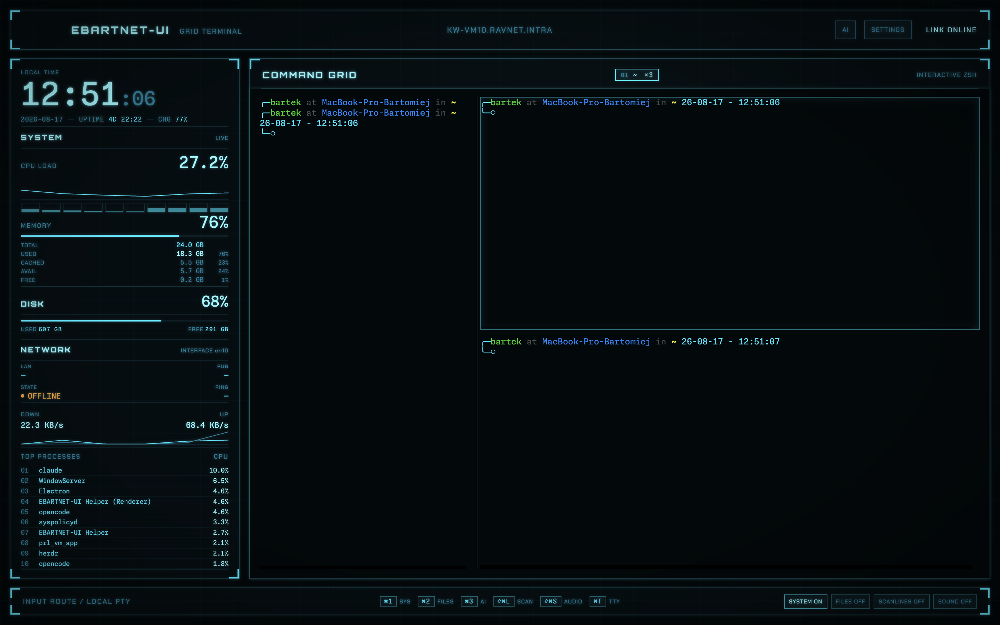
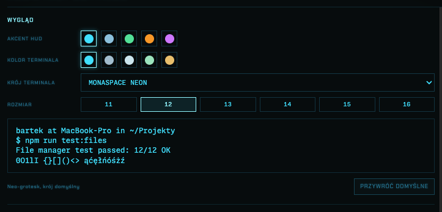
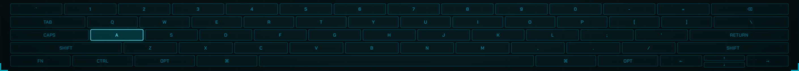

<p align="center">
  
</p>

<p align="center">
  <a href="#quick-start"></a>
  <a href="package.json"></a>
  <a href="package.json"></a>
  <a href="#ai-assistant"></a>
  <a href="LICENSE"></a>
</p>

<p align="center">
  <b>A real terminal that looks like it fell out of the Grid.</b><br>
  Native Apple Silicon, a genuine zsh PTY with iTerm2-style split panes, live system<br>
  telemetry, a file manager and an AI assistant that runs on your own machine.
</p>

<p align="center">
  
</p>

---

## Why this exists

Most "futuristic terminal" projects are either a pretty shell prompt or a mock-up that
cannot actually run a shell. EBARTNET-UI is a working terminal first: `node-pty` spawns a
real login `zsh`, `xterm.js` renders it, and every HUD panel around it is fed by live system
data — not animation loops.

It is written from scratch. The visual language is a tribute to [eDEX-UI](https://github.com/GitSquared/edex-ui)
and *Tron: Legacy*; none of the original source was copied.

<p align="center">
  
</p>

## Features

**Terminal that is actually a terminal**
- Real `zsh` login shell through `node-pty`, rebuilt for `arm64`
- Multiple tabs (`⌘T`), rename, close, automatic respawn when a shell exits
- **Split panes inside a tab** (`⌘D` / `⇧⌘D`), nested to any depth, each pane its own shell
- Full-pane zoom (`⇧⌘⏎`) without disturbing the split layout underneath
- Drag files from Finder or the built-in browser straight into the prompt — paths are shell-quoted for you
- Search the scrollback like iTerm2 (`⌘F`) — match counter, `⏎`/`⇧⏎` to step through, `Esc` to close
- Clickable URLs open in your default browser; WebGL-accelerated rendering with a silent canvas fallback
- `⌘K` clears the active pane's scrollback; a HUD dialog warns before a multi-line paste actually lands
- Scrollback depth is configurable in `SETTINGS` (1K–100K lines), applied live
- A background pane's tab/chip lights up once a command running ≥15s finishes, with an optional chime
- An optional on-screen keyboard (`⇧⌘K`) lights up each key as you type — display-only, it never reads or injects input

**Live telemetry, not decoration**
- CPU load with per-core bars and history sparkline
- GPU load with a render/tiler breakdown, read from the same IOAccelerator counters Activity Monitor uses — no extra permission prompt
- Memory broken down into used / cached / available / free / swap, with a segmented bar
- Disk usage, network throughput, LAN + public IPv4, latency, battery
- Top processes sortable by CPU, memory or energy impact — or flip the same panel to CONN for the machine's live network connections

**A file manager, not just a listing**
- `LIST` · `DETAILS` (size + modified date) · `TILES` (icon grid)
- Follows the terminal's working directory live, or detach and browse freely
- Finder semantics: click selects, double-click opens; `⌘`-click and `⇧`-click extend the selection
- Context menu with rename, copy, move, new folder, copy path, reveal in Finder
- Deletions go to the **Trash**, and directories or batches ask for confirmation first
- Column sorting, `⌘F` filter, `⌘C`/`⌘V`, hover preview for images, dotfile toggle

**Themes you control from SETTINGS**
- Five HUD accents repaint the entire interface — every panel, border and glow
- Terminal colour, typeface and size are set separately, with a live preview
- Seven bundled monospace faces, all with Nerd Font glyphs kept as fallback
- Choices persist between launches; one button restores the defaults
- **Bring your own accent**: drop a JSON file into `userData/themes/` and it shows up in
  SETTINGS next to the built-ins, prefixed `CUSTOM:`

Custom themes live in `~/Library/Application Support/EBARTNET-UI/themes/`. The app seeds one
example there the first time that folder is created:

```json
{
  "name": "RINZLER",
  "accent": { "cyan": [210, 20, 20], "cyanBright": [255, 130, 110], "cyanDim": [110, 10, 10] },
  "terminalColor": { "foreground": [255, 90, 70], "cursor": [255, 170, 140] }
}
```

`terminalColor` is optional — omit it and the accent's own colours double as the terminal
palette. A malformed file is skipped with a console warning, never a crash, and deleting the
file behind your selected theme falls back to the default cyan the next time it's read.

**AI assistant, local-first**
- Chat panel docked next to the terminal, resizable and persistent
- Four providers: **Ollama**, **LM Studio** (local) · **OpenRouter**, **OpenCode Go** (cloud)
- Models are discovered dynamically from each provider's catalogue
- Optional web search through the Brave Search API
- `ai` and `search` commands available directly inside the shell

<p align="center">
  
</p>
<p align="center"><i>One tab, three shells: <code>⌘D</code> splits side by side, <code>⇧⌘D</code> stacks.</i></p>

<p align="center">
  
</p>
<p align="center"><i>SETTINGS → WYGLĄD. The sixth, red swatch is a custom theme loaded from a JSON
file — the interface labels are in Polish; the shell is yours.</i></p>

<p align="center">
  
</p>
<p align="center"><i>The on-screen keyboard (<code>⇧⌘K</code>) — display-only, it never reads or injects input.</i></p>

<p align="center">
  
</p>

## Download

**[⬇ EBARTNET-UI 0.1.0 for Apple Silicon (.dmg)](https://github.com/bkleparski/eDEX-UI-BK/releases/latest)**

Open the `.dmg` and drag the app to `Applications`. That's it — nothing else to install.

> **First launch.** The app is ad-hoc signed and not notarised by Apple, so macOS will warn
> about an unidentified developer. Right-click the icon → **Open** → confirm **Open**.

Requires macOS on Apple Silicon (arm64).

> **Keep a single copy.** Two builds of this app in different folders share one bundle
> identifier, and macOS may then open whichever it finds first — which looks exactly like
> your changes not taking effect.

## Keyboard shortcuts

**Terminal**

| Shortcut | Action |
| --- | --- |
| `⌘T` | New terminal tab |
| `⌘D` | Split the focused pane side by side |
| `⇧⌘D` | Split the focused pane top and bottom |
| `⌥⌘←↑→↓` | Move focus to the neighbouring pane |
| `⇧⌘W` | Close the focused pane (the last one closes its tab) |
| `⇧⌘⏎` | Toggle full-pane zoom for the focused pane |
| `⌘F` | Search the scrollback (opens the FILES filter instead if that panel has real focus) |
| `⌘K` | Clear the active pane's scrollback |

Panes nest to any depth, and each one runs its own shell. Drag a border to rebalance a pair
(no pane shrinks below 12%), and the focused pane is outlined once a tab holds more than one.
Tabs and panes share a budget of 8 shells in total. Zoom hides every sibling along the path to
the root without touching the split tree itself — a `⤢` marker shows on the zoomed pane's chip
and tab, and it exits on its own when you switch tabs, close the pane, or navigate with the
arrow-focus shortcut above.

A split tab branches in the bar — `01 ├ claude ├ codex` — with one chip per pane, named after
the process it is running. Click a chip to focus that pane, right-click it to rename or close
that pane alone. A pane that just finished a command running ≥15s lights up its chip (and tab,
if it's not the focused pane) with a small dot — with an optional two-tone chime if keystroke
sounds are on — so you notice a long build finishing in a pane you're not watching.

The search bar (`⌘F`) sits over the active pane with a live match counter; `⏎`/`⇧⏎` step to the
next/previous hit and `Esc` closes it and returns focus to the shell. A dialog also intercepts
any paste with more than one line, showing a preview before it reaches the shell — multi-line
pastes are a common way to run something you didn't mean to.

**HUD**

| Shortcut | Action |
| --- | --- |
| `⌘1` | Toggle the SYSTEM telemetry column |
| `⌘2` | Toggle the FILE SYSTEM panel |
| `⌘3` | Toggle the AI ASSISTANT panel |
| `⇧⌘L` | Toggle the scanline overlay |
| `⇧⌘S` | Toggle keystroke sounds |
| `⇧⌘K` | Toggle the on-screen keyboard |

**File browser** (while the panel is open)

| Shortcut | Action |
| --- | --- |
| `⌘F` | Filter the listing |
| `⌘A` | Select everything |
| `⌘C` / `⌘V` | Copy the selection / paste it here |
| `⌥⌘C` | Copy the full paths to the clipboard |
| `⇧⌘N` | New folder |
| `⌘↑` | Go to the parent directory |
| `⏎` | Open the selection |
| `⌫` | Move the selection to the Trash |
| `⇧⌘.` | Show/hide dotfiles |

The FILE SYSTEM and AI panels share the right-hand slot: opening one closes the other.
Drag the separator (or focus it and use the arrow keys) to rebalance the split; your width
is remembered.

## AI assistant

| Provider | Endpoint | Available in |
| --- | --- | --- |
| Ollama | `http://127.0.0.1:11434` | HUD + terminal |
| LM Studio | `http://127.0.0.1:1234/v1` | HUD + terminal |
| OpenRouter | cloud | HUD only |
| OpenCode Go | cloud | HUD only |

Inside the shell:

```text
ai <prompt>             # Ollama
ai --lms <prompt>       # LM Studio
search <query>          # Brave Search + Ollama
search --lms <query>    # Brave Search + LM Studio
```

The shell commands talk to the main process over a per-process Unix socket guarded by a
random token, and responses are stripped of ANSI and control sequences before they reach
your terminal. Cloud providers are deliberately **not** reachable from the shell.

<p align="center">
  
</p>

### Configuration and keys

API keys are entered in `SETTINGS` and stored in `config.json` inside Electron's `userData`
directory with `0600` permissions. **They are stored in plaintext** — a deliberate trade-off
for a single-user local tool, not a recommendation. The renderer process never receives key
values, only whether a key is configured. Conversation history lives in memory only and is
never written to disk.

## Architecture

```
src/
├── main.js                    Electron main: PTY, telemetry, file IPC, window lifecycle
├── preload.js                 contextBridge — the only renderer↔main surface
├── main/
│   ├── config-store.js        atomic 0600 config writes, secrets never leave main
│   ├── theme-file-validator.js  validates userData/themes/*.json (pure, unit-tested)
│   ├── assistant/             provider registry, agent loop, Brave tool, CLI bridge
│   └── e2e/                   drivers behind npm run test:smoke/visual/files/panes/assistant-ui
└── renderer/
    ├── renderer.js             terminal sessions, HUD controls, boot sequence, shortcuts
    ├── terminal-panes.js       split/stack/zoom layout, search, TTY rename, context menu
    ├── telemetry-ui.js         CPU/GPU/memory/network panels, TOP PROCESSES/CONN switch
    ├── file-browser.js         LIST/DETAILS/TILES, drag-drop, rename, trash
    ├── filesystem-ui.js        file panel toggle, resize, view modes
    ├── panel-resizer.js        the draggable split between the terminal and a side panel
    ├── assistant-ui.js         AI panel + settings dialog
    ├── theme.js                built-in + custom accent/colour/typeface presets, persistence
    ├── theme-ui.js             the WYGLĄD controls in SETTINGS
    ├── theme-tokens.css        RGB triplets every translucent surface is composed from
    └── styles.css              the entire Tron/GRID visual system
```

Tabs own a layout tree of panes, and that tree lives in the DOM: a `.terminal-split` always
holds exactly two children — a pane or another split — so closing one collapses the split by
hoisting its sibling. Themes work the same way: every translucent colour is composed from an
RGB triplet, so swapping five variables on `:root` repaints the whole HUD without touching a
single component.

The renderer runs sandboxed with a strict CSP (`connect-src 'none'`): it cannot reach the
network at all. Every outbound request goes through the main process.

## Web mode & Docker

The renderer has no Electron API calls baked into it — `src/preload.js`'s five globals
(`terminalApi`, `monitoringApi`, `filesApi`, `settingsApi`, `assistantApi`) are the only surface
it touches, and every renderer file talks to those, never to Electron directly. `src/server/index.js`
implements that same contract over a WebSocket instead of `contextBridge`, so the identical UI —
terminal, telemetry, file manager, assistant — runs in a plain browser tab, on macOS or Linux,
with no Electron in the loop.

**Run it directly:**

```bash
npm run web
```

Prints a URL with a token on stdout — `http://127.0.0.1:3040/?token=…` — open it in a browser.
Set `EDEX_WEB_TOKEN` yourself to pin it instead of getting a random one every run; `EDEX_WEB_PORT`
(default `3040`) and `EDEX_WEB_BIND` (default `127.0.0.1`) are also overridable.

**Run it in Docker** (the way to get it onto a Linux host; also works on macOS):

```bash
EDEX_WEB_TOKEN=$(openssl rand -hex 32) docker compose up -d --build
docker compose logs   # same URL, for the token you just set
```

`docker-compose.yml` publishes `127.0.0.1:3040` on the host — loopback only, matching the
bare-metal default — and keeps settings/custom themes in a named volume across restarts (same
shape as `userData` above, mounted at `/data` instead). **Always set `EDEX_WEB_TOKEN` yourself
when using Compose** — unlike running the server directly, its default falls back to the literal
placeholder string committed in `docker-compose.yml`, not a randomly generated one.

> **The token is a shell on whatever machine is running the server.** Anyone who has it can run
> arbitrary commands as that user, read, write or permanently delete any file it can reach, and
> read or change its AI provider settings. Never publish the port to the internet — reach it
> remotely only through something already trusted in front of it (a Cloudflare Tunnel, an SSH
> port-forward), the same way you'd treat a password to the box itself.

**Requirements:** macOS needs Docker Desktop or [Colima](https://github.com/abiosoft/colima)
running before `docker compose up`; Linux just needs Docker itself, no VM layer in between.

**Differences from the Electron app:**
- No OS Trash — deleting a file is permanent (`fs.rm`), and the confirmation dialog says so instead of offering "Move to Trash"
- No "Reveal in Finder" and no opening a file in its system default app — there's no Finder or `open` for the server to hand it to
- Native folder-picker and confirm dialogs are replaced with HUD-styled ones drawn into the page itself
- No `ai`/`search` shell commands — the local CLI bridge that wires those into the terminal's environment is Electron-only
- GPU load, energy impact (`ENERGY`) and live connections (`CONN`) all come from macOS-only tools (`ioreg`, `top -o power`, `lsof`) — running the server itself on macOS still has them, but the Linux/Docker image doesn't, and those panels/buttons just don't appear there; `TOP PROCESSES` sorts by CPU/memory only

## Development

Only needed if you want to change the code — users install the `.dmg` above.

> **Requirements:** macOS on Apple Silicon, Node.js 22 or newer.

```bash
git clone https://github.com/bkleparski/eDEX-UI-BK.git
cd eDEX-UI-BK
npm install      # also rebuilds node-pty for arm64
npm start           # run from source
npm run dist        # produce the .app, .dmg and .zip in dist/
npm run install:app # build and replace /Applications/EBARTNET-UI.app
```

### Tests

```bash
npm run lint                  # eslint across main and renderer
npm run test:unit             # provider, config, CLI-bridge, telemetry and theme-file tests
npm run test:smoke            # boots Electron, verifies the PTY round-trip
npm run test:files            # file manager + theme behaviour on a temp directory
npm run test:panes            # split, stack, navigate, resize and close panes
npm run test:visual           # full UI walkthrough + screenshot diagnostics
npm run test:assistant-ui     # live assistant run (needs Ollama + LM Studio up)
npm run test:providers:local  # Ollama / LM Studio reachability
npm run test:cli:local        # ai / search shell commands
npm run test:providers:cloud  # needs OPENROUTER_API_KEY + OPENCODE_GO_API_KEY in env
```

Screenshots for the README are generated with `EDEX_FORCE_OFFLINE_TEST=1` so no LAN or
public IP address ends up in a published image. No test script contains or writes credentials.

## Credits

Visual and functional inspiration: [eDEX-UI](https://github.com/GitSquared/edex-ui) by
GitSquared, itself inspired by the DEX-UI from *Tron: Legacy*. Built with
[Electron](https://www.electronjs.org/), [xterm.js](https://xtermjs.org/),
[node-pty](https://github.com/microsoft/node-pty) and
[systeminformation](https://systeminformation.io/).

## License

[MIT](LICENSE) © 2026 Bartłomiej Kleparski — use it, fork it, build something of your own
with it. Attribution is all that's asked.

The bundled typefaces keep their own licences (SIL Open Font License), included next to the
font files in `src/renderer/assets/fonts/`.
