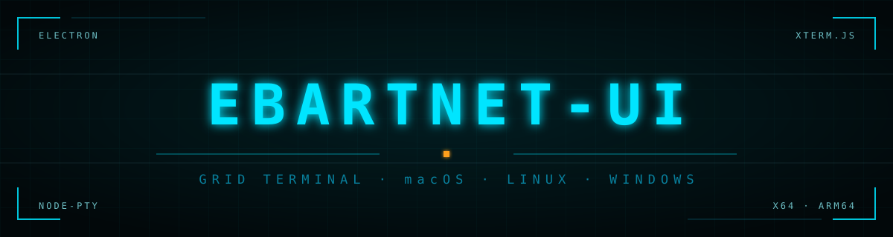
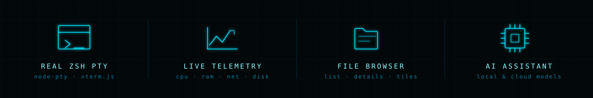
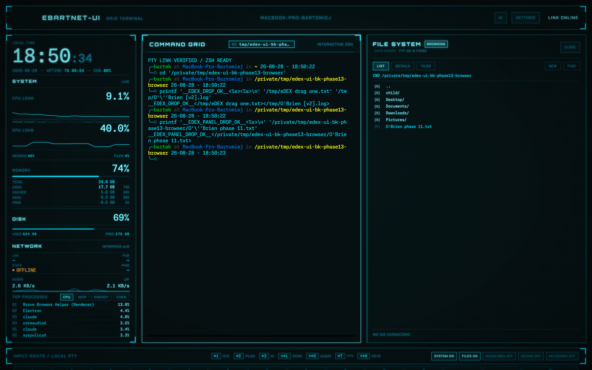
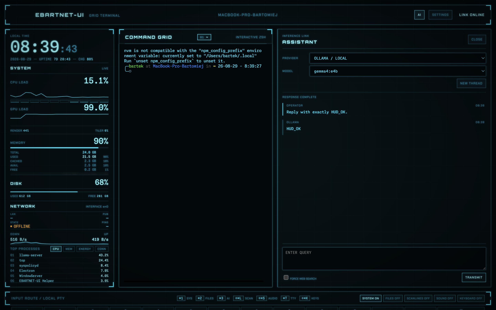
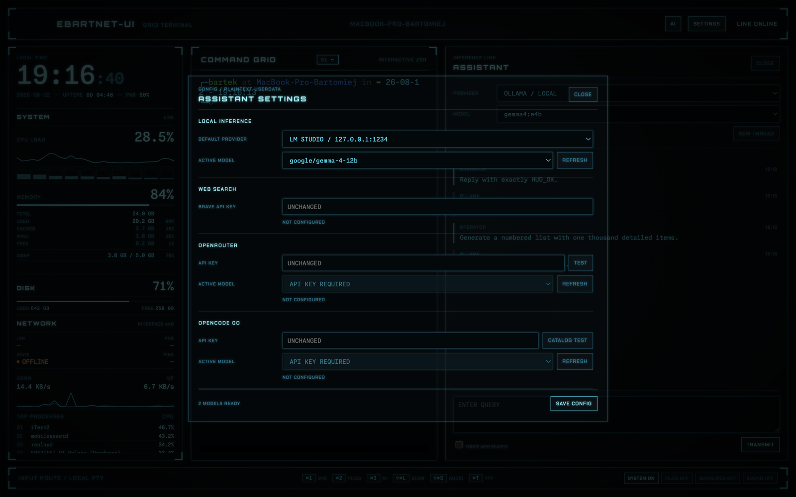

<p align="center">
  
</p>

<p align="center">
  <a href="#quick-start"></a>
  <a href="package.json"></a>
  <a href="package.json"></a>
  <a href="#ai-assistant"></a>
</p>

<p align="center">
  <b>A real terminal that looks like it fell out of the Grid.</b><br>
  Native Apple Silicon, a genuine zsh PTY, live system telemetry, a file browser<br>
  and an AI assistant that runs on your own machine.
</p>

<p align="center">
  
</p>

---

## Why this exists

Most "futuristic terminal" projects are either a pretty shell prompt or a mock-up that
cannot actually run a shell. EBARTNET-UI is a working terminal first: `node-pty` spawns a
real login `zsh`, `xterm.js` renders it, and every HUD panel around it is fed by live system
data — not animation loops.

It is written from scratch. The visual language is a tribute to [eDEX-UI](https://github.com/GitSquared/edex-ui)
and *Tron: Legacy*; none of the original source was copied.

<p align="center">
  
</p>

## Features

**Terminal that is actually a terminal**
- Real `zsh` login shell through `node-pty`, rebuilt for `arm64`
- Multiple tabs (`⌘T`), rename, close, automatic respawn when a shell exits
- Drag files from Finder or the built-in browser straight into the prompt — paths are shell-quoted for you

**Live telemetry, not decoration**
- CPU load with per-core bars and history sparkline
- Memory broken down into used / cached / available / free / swap, with a segmented bar
- Disk usage, network throughput, LAN + public IPv4, latency, battery
- Top processes sorted by CPU, refreshed continuously

**File browser with three views**
- `LIST` · `DETAILS` (size + modified date) · `TILES` (icon grid)
- Follows the terminal's working directory live, or detach and browse freely
- Hover preview for images, dotfile toggle, drag-and-drop into the shell

**AI assistant, local-first**
- Chat panel docked next to the terminal, resizable and persistent
- Four providers: **Ollama**, **LM Studio** (local) · **OpenRouter**, **OpenCode Go** (cloud)
- Models are discovered dynamically from each provider's catalogue
- Optional web search through the Brave Search API
- `ai` and `search` commands available directly inside the shell

<p align="center">
  
</p>

## Download

**[⬇ EBARTNET-UI 0.1.0 for Apple Silicon (.dmg)](https://github.com/bkleparski/eDEX-UI-BK/releases/latest)**

Open the `.dmg` and drag the app to `Applications`. That's it — nothing else to install.

> **First launch.** The app is ad-hoc signed and not notarised by Apple, so macOS will warn
> about an unidentified developer. Right-click the icon → **Open** → confirm **Open**.

Requires macOS on Apple Silicon (arm64).

> **Keep a single copy.** Two builds of this app in different folders share one bundle
> identifier, and macOS may then open whichever it finds first — which looks exactly like
> your changes not taking effect.

## Keyboard shortcuts

| Shortcut | Action |
| --- | --- |
| `⌘1` | Toggle the SYSTEM telemetry column |
| `⌘2` | Toggle the FILE SYSTEM panel |
| `⌘3` | Toggle the AI ASSISTANT panel |
| `⌘T` | New terminal tab |
| `⇧⌘.` | Show/hide dotfiles in the browser |
| `⇧⌘L` | Toggle the scanline overlay |
| `⇧⌘S` | Toggle keystroke sounds |

The FILE SYSTEM and AI panels share the right-hand slot: opening one closes the other.
Drag the separator (or focus it and use the arrow keys) to rebalance the split; your width
is remembered.

## AI assistant

| Provider | Endpoint | Available in |
| --- | --- | --- |
| Ollama | `http://127.0.0.1:11434` | HUD + terminal |
| LM Studio | `http://127.0.0.1:1234/v1` | HUD + terminal |
| OpenRouter | cloud | HUD only |
| OpenCode Go | cloud | HUD only |

Inside the shell:

```text
ai <prompt>             # Ollama
ai --lms <prompt>       # LM Studio
search <query>          # Brave Search + Ollama
search --lms <query>    # Brave Search + LM Studio
```

The shell commands talk to the main process over a per-process Unix socket guarded by a
random token, and responses are stripped of ANSI and control sequences before they reach
your terminal. Cloud providers are deliberately **not** reachable from the shell.

<p align="center">
  
</p>

### Configuration and keys

API keys are entered in `SETTINGS` and stored in `config.json` inside Electron's `userData`
directory with `0600` permissions. **They are stored in plaintext** — a deliberate trade-off
for a single-user local tool, not a recommendation. The renderer process never receives key
values, only whether a key is configured. Conversation history lives in memory only and is
never written to disk.

## Architecture

```
src/
├── main.js                  Electron main: PTY, telemetry, file IPC, window lifecycle
├── preload.js               contextBridge — the only renderer↔main surface
├── main/
│   ├── config-store.js      atomic 0600 config writes, secrets never leave main
│   └── assistant/           provider registry, agent loop, Brave tool, CLI bridge
└── renderer/
    ├── renderer.js          terminal, telemetry, file browser, HUD controls
    ├── assistant-ui.js      AI panel + settings dialog
    ├── filesystem-ui.js     file panel toggle, resize, view modes
    └── styles.css           the entire Tron/GRID visual system
```

The renderer runs sandboxed with a strict CSP (`connect-src 'none'`): it cannot reach the
network at all. Every outbound request goes through the main process.

## Development

Only needed if you want to change the code — users install the `.dmg` above.

> **Requirements:** macOS on Apple Silicon, Node.js 22 or newer.

```bash
git clone https://github.com/bkleparski/eDEX-UI-BK.git
cd eDEX-UI-BK
npm install      # also rebuilds node-pty for arm64
npm start        # run from source
npm run dist     # produce the .app, .dmg and .zip in dist/
```

### Tests

```bash
npm run test:unit             # provider, config and CLI-bridge unit tests
npm run test:smoke            # boots Electron, verifies the PTY round-trip
npm run test:files            # file manager + theme behaviour on a temp directory
npm run test:visual           # full UI walkthrough + screenshot diagnostics
npm run test:assistant-ui     # live assistant run (needs Ollama + LM Studio up)
npm run test:providers:local  # Ollama / LM Studio reachability
npm run test:cli:local        # ai / search shell commands
npm run test:providers:cloud  # needs OPENROUTER_API_KEY + OPENCODE_GO_API_KEY in env
```

Screenshots for the README are generated with `EDEX_FORCE_OFFLINE_TEST=1` so no LAN or
public IP address ends up in a published image. No test script contains or writes credentials.

## Credits

Visual and functional inspiration: [eDEX-UI](https://github.com/GitSquared/edex-ui) by
GitSquared, itself inspired by the DEX-UI from *Tron: Legacy*. Built with
[Electron](https://www.electronjs.org/), [xterm.js](https://xtermjs.org/),
[node-pty](https://github.com/microsoft/node-pty) and
[systeminformation](https://systeminformation.io/).

## License

All rights reserved. The source is public for reference; it is not currently released
under an open-source licence.
